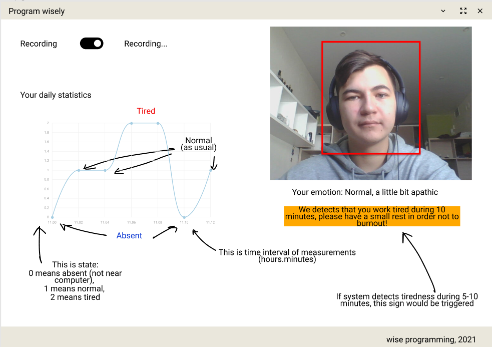

## wise-programming 
[Under Development] Emotion analyser tool for programmers

## Description

This desktop application tracks the facial expressions while human is working on the computer and detects emotion changes: tiredness, angriness, apathy - while coding. When the program detects tiredness during some interval (e.x 1-2 minutes)- it shows a pop-up/notification with suggestion to make a short brake.

## Home page of desktop application (low-fidelity design)

In the home page there would be:
- button that turns on/off tracking face expressions from web-camera 
- real-time charts with feeling of user (if user is at computer, if he is tired of if he is fine) - multiple feeling would be captured.
- captured frames from user (with bounding box of face)
- emotion description 
- notification/pop-up if user is tired/angry during 5-10 minutes.

## Sketch of application components

## Stack of technologies

- The desktop application will be written using `PyQT5` framework and will be written purely in Python.
- As a database we will use `PostgreSQL` - the most popular database. Maybe SQLite would be sufficient.
- ML emotion analyser component will be written in Pytorch/Pytorch-Lightning libraries.

## How to launch application

As I know, PyQT and pytorch frameworks are cross-platform, so all os windows/linux/mac will be supported.
I am planning to host application only on AUR repositories, and also I will leave instructions on how to install application directly from github repository.

## Contributing

This project is planned to be a small pet project and be made only by myself. If you want to participate in the development process - write to me and we will try to work together.

## Authors

Arslanov Shamil, student of Innopolis University